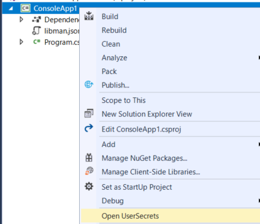
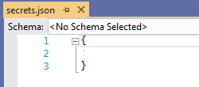
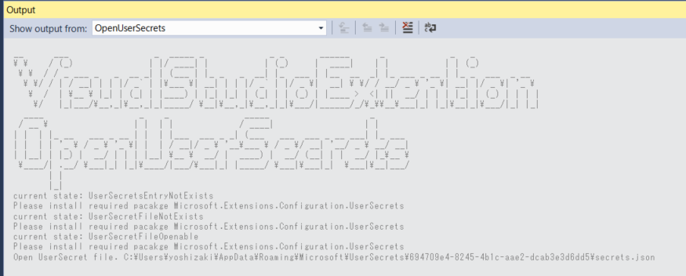

 

# OpenUserSecrets

## Motivation

**UPDATE: 04/Jan/2020**

I believe VS2019 has built in support for `Manage UserSecrets` in Console App, too.
You don't need use this extensions if you found context menu.

**Original**

ASP.NET Core project has builtin support for "Manage UserSecrets" when installed "Microsoft.Extensions.Configuration.UserSecrets", however it never appear when installed on .NET Core Console Project.

This Extension will offer access UserSecret to .NET Core Console/Generic project, like ASP.NET Core MVC Project has.

> [Safe storage of app secrets in development in ASP.NET Core - access-a-secret
](https://docs.microsoft.com/en-us/aspnet/core/security/app-secrets?view=aspnetcore-2.2#access-a-secret)

## Install

You have 2 choice.

1. Visual Studio > Tools > Extensions and Updates > search `Open UserSecrets`.
1. Go to https://marketplace.visualstudio.com/items?itemName=guitarrapc.OpenUserSecrets and download > install.

## How it works

Visual Studio Extensions to manage UserSecret, generate and open UserSecret json.

The Open User Secret makes it easy to manage UserSecrets and work with your .NET Core project.

Right click ib the Project in Solution Explorer. You will find "Open UserSecret" in the Context menu and UserSecret's secret.json will be open in Visual Studio.

For more information about the extension, visit https://github.com/guitarrapc/OpenUserSecrets

## What extension manage

1. If PropertyItem "UserSecretsId" entry is missing in .csproj, add entry with random GUID.
1. If "secret.json" file is missing, create file.
1. Open "secret.json" on the Visual Studio.

> Current Status and secret path will output in Visual Studio OutputWindow.

## Q&A

### Why Microsoft.Extensions.Configuration.UserSecrets package not found message shown on output window?

* for .NETCore Console Project, install Microsoft.Extensions.Configuration.UserSecrets to the project.
    * Use PackageReference NuGet management style.

## Versions

See https://github.com/guitarrapc/OpenUserSecrets/releases for detail.

* 1.0.3 : fix: extension installation to vs2019 blocked by missing Visual Studio MPF 15.0
* 1.0.2 : feat: add empty json when secrets.json is created via extension
* 1.0.1 : feat: add vs2019 support
* 1.0.0 : Initial release
